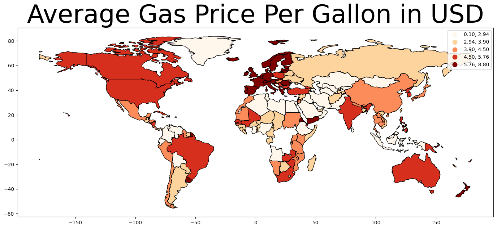
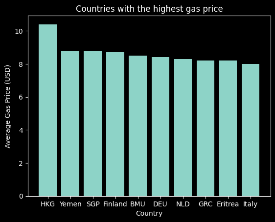
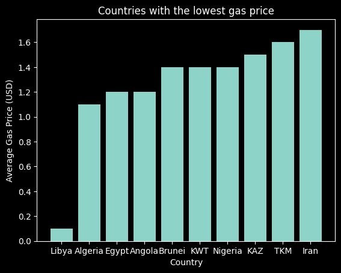

# Global Cost of Living 

#### By Reed Carter, Chloe Le, Phil Kendall

#### Visualizations of the cost of living around the globe 

## Technologies Used

* github
* python
* pandas
* jupyterlab
* matplotlib
* geopandas
* pycountry
* mapclassify
* folium

## Description

The main.py file contains numerous lines of code which display various images which indicate the different cost of living across the world. This information can be used to determine the cost of living across the world. A complete repository can be found here: https://github.com/Reed-Carter/Global-Cost-of-Living

## Setup/Installation Requirements

* Clone this repository to your desktop
* Navigate to the top level directory
* Run 'pip install -r requirements.txt' to install all the requirements so that main.py can run correctly
* Open main.py

## Known Bugs

* no known bugs

## License

MIT License

Copyright (c) [2022] [Reed Carter, Chloe Le, Phil Kendall]

Permission is hereby granted, free of charge, to any person obtaining a copy
of this software and associated documentation files (the "Software"), to deal
in the Software without restriction, including without limitation the rights
to use, copy, modify, merge, publish, distribute, sublicense, and/or sell
copies of the Software, and to permit persons to whom the Software is
furnished to do so, subject to the following conditions:

The above copyright notice and this permission notice shall be included in all
copies or substantial portions of the Software.

THE SOFTWARE IS PROVIDED "AS IS", WITHOUT WARRANTY OF ANY KIND, EXPRESS OR
IMPLIED, INCLUDING BUT NOT LIMITED TO THE WARRANTIES OF MERCHANTABILITY,
FITNESS FOR A PARTICULAR PURPOSE AND NONINFRINGEMENT. IN NO EVENT SHALL THE
AUTHORS OR COPYRIGHT HOLDERS BE LIABLE FOR ANY CLAIM, DAMAGES OR OTHER
LIABILITY, WHETHER IN AN ACTION OF CONTRACT, TORT OR OTHERWISE, ARISING FROM,
OUT OF OR IN CONNECTION WITH THE SOFTWARE OR THE USE OR OTHER DEALINGS IN THE
SOFTWARE.